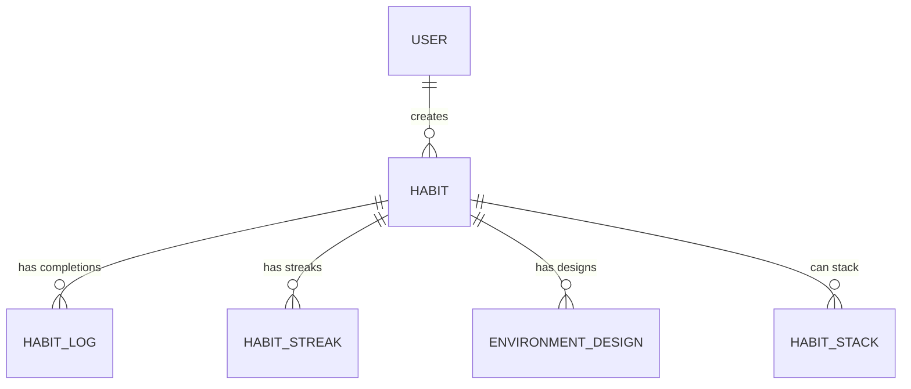

# Atomic Habits Management System Documentation
## Table of ContentsOverview

Our Atomic Habits Management System is a comprehensive application designed to help users build, track, and maintain positive habits using principles from James Clear's "Atomic Habits". The system implements habit formation concepts including cue-routine-reward cycles, habit stacking, and environment design.

---
## Table of Contents
- [System Overview](#system-overview)
- [Core Principles](#core-principles)
- [Database Schema](#database-schema)
- [Endpoints](#endpoints)
- [User Interface Guide](#user-interface-guide)
- [Setup](#setup)
---

## System Overview
A complete habit-tracking application implementing James Clear's Atomic Habits methodology with:

- **Habit Formation Tracking**
- **Streak Monitoring**
- **Habit Stacking**
- **Environment Design**
- **Analytics Dashboard**

---

## Core Principles
Built around the 4 Laws of Behavior Change:

| Law | Implementation | Example |
|-----|----------------|---------|
| **Make it Obvious** | Visual cues in UI | Habit cards show triggers |
| **Make it Attractive** | Reward tracking | Completion badges |
| **Make it Easy** | 2-minute rule | Micro-habit suggestions |
| **Make it Satisfying** | Streak counters | Weekly progress reports |

---

## Database Schema

### Entity Relationship Diagram

---

## Endpoints

### 🧠 Habits

| Method | Endpoint         | Description           |
|--------|------------------|-----------------------|
| GET    | `/habits`        | List all habits       |
| POST   | `/habits`        | Create new habit      |
| GET    | `/habits/{id}`   | Get specific habit    |
| DELETE | `/habits/{id}`   | Delete a habit          |

---

### ✅ Habit Logging

| Method | Endpoint             | Description              |
|--------|----------------------|--------------------------|
| POST   | `/habits/log`        | Log habit completion     |
| GET    | `/habits/{id}/logs`  | Get completion history   |

---

### Habit Stacks

| Method | Endpoint    | Description           |
|--------|-------------|-----------------------|
| POST   | `/stacks`   | Create new habit stack|
| GET    | `/stacks`   | List all stacks       |

---

### 🌿 Environment

| Method | Endpoint         | Description                   |
|--------|------------------|-------------------------------|
| POST   | `/environment`   | Add environment design        |
| GET    | `/environment`   | List environment modifications|

---

## User Interface Guide

### 📊 Dashboard

- **Habit Streaks**:showing completion history
- **All Habits**: Display of active habit streaks
- **Stacking Habits**: Stack your habits to create natural transition.
- 
---

### ➕ Habit Creation

- **Enter** habit name and type (good/bad)
- **Define**:
  - Cue
  - Craving
  - Response
  - Reward

---

### 🛠️ logging Habits

- **Habit Selection**: Choose which habit to design for
- **Notes**: Adding a note that you need remember about the habit

### 🛠️ Habits stacking
- **Habit 1**: stacking habits 
- **Habit 2**: After I [Habit 1], I will [Habit 2]

### 🛠️ Environment Design
- **Tag by type:**:
  - Visual Cues
  - Obstacle Removal
  - Helpful Additions
- **Log environmental changes**

### Setup

1. Clone repository
2. Configure database connection
